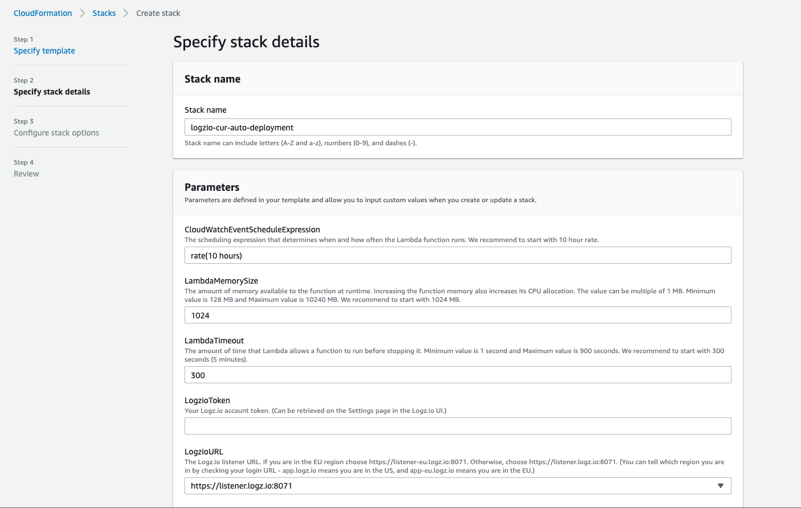
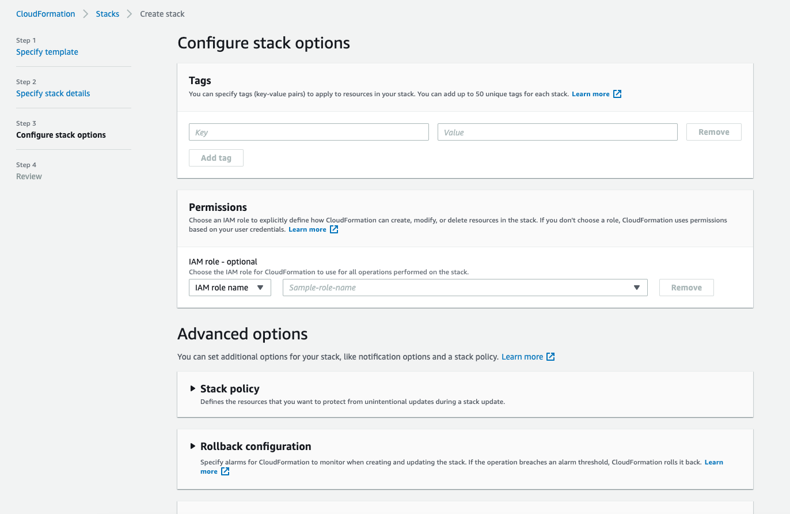
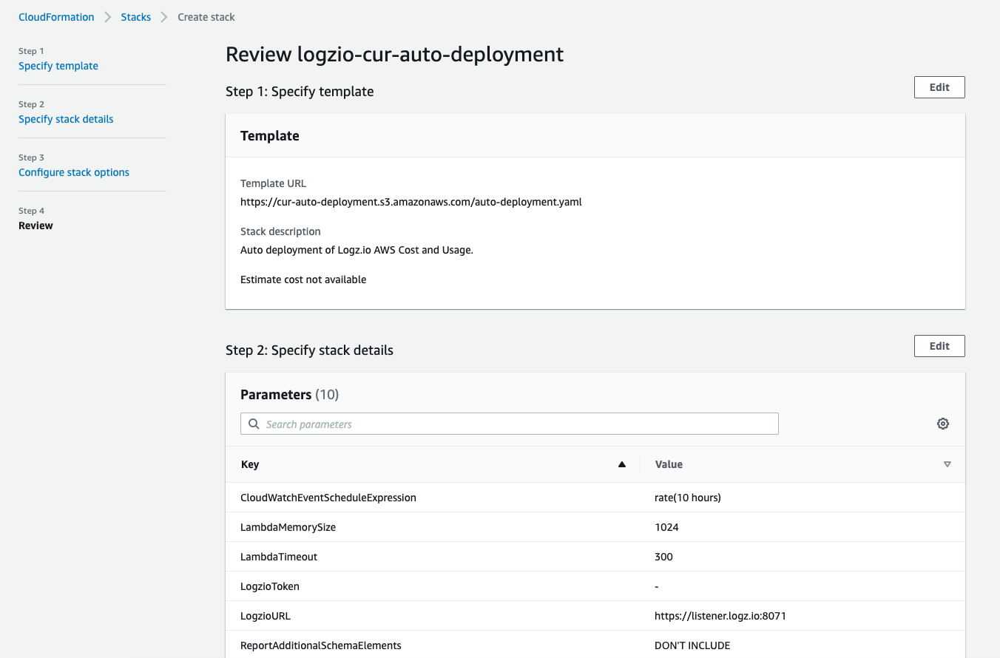
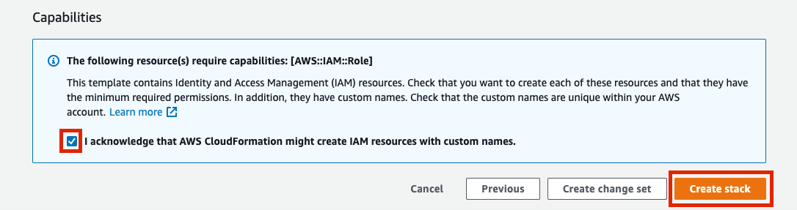
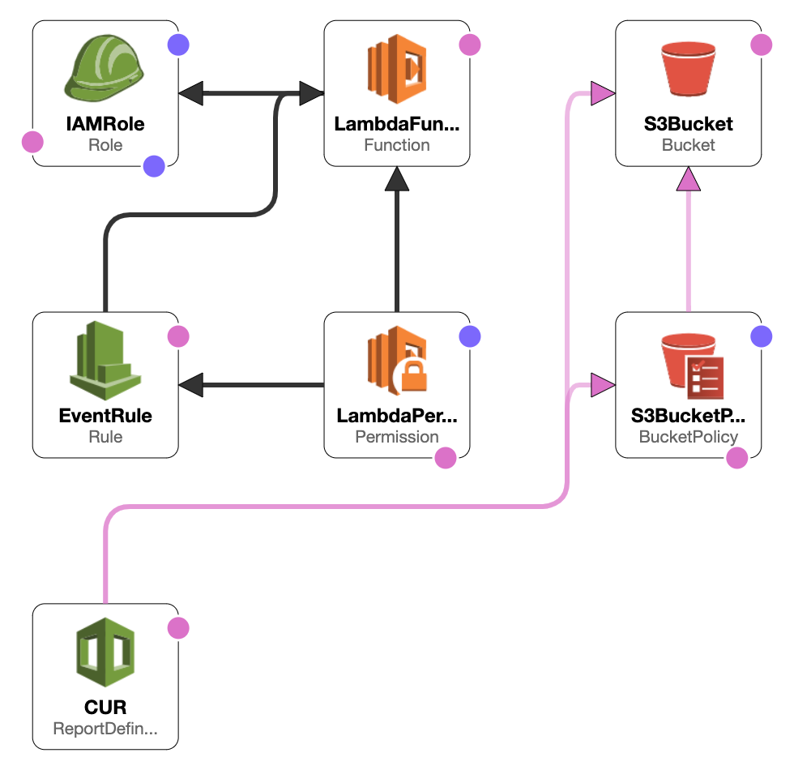

# AWS Cost and Usage Auto-Deployment
 
Auto-deployment of S3 bucket, Cost and Usage report and Lambda function that collects AWS Cost and Usage reports and sends them to Logz.io in bulk, over HTTP.

## Getting Started

To start just press the button and follow the instructions:

You'll be taken to AWS, where you'll configure the resources to be deployed. Keep the defaults and click Next:

Fill in all the stack parameters and click **Next**:

| Parameter | Description |
| --- | --- |
| CloudWatchEventScheduleExpression | `Default: rate(10 hours)` The scheduling expression that determines when and how often the Lambda function runs. We recommend to start with 10 hours rate. |
| LambdaMemorySize | `Default: 1024 (MB)` The amount of memory available to the function at runtime. We recommend to start with 1024 MB. |
| LambdaTimeout | `Default: 300 (seconds)` The amount of time that Lambda allows a function to run before stopping it. We recommend to start with 300 seconds (5 minutes). |
| LogzioToken | Your Logz.io account token. (Can be retrieved on the Settings page in the Logz.io UI.) |
| LogzioURL | The Logz.io listener URL. If you are in the EU region choose https://listener-eu.logz.io:8071. Otherwise, choose https://listener.logz.io:8071. (You can tell which region you are in by checking your login URL - app.logz.io means you are in the US, and app-eu.logz.io means you are in the EU.) |
| ReportAdditionalSchemaElements | Choose INCLUDE if you want AWS to include additional details about individual resources IDs in the report (This might significantly increase report size and might affect performance. AWS Lambda can run for up to 15 minutes with up to 10240 MB, and the process time for the whole file must end within this timeframe.), or DON'T INCLUDE otherwise. |
| ReportName | The name of report that you want to create. |
| ReportPrefix | The prefix that AWS addes to the report name when AWS delivers the report. |
| ReportTimeUnit | The granularity of the line items in the report. Can be Hourly, Daily or Monthly. (Enabling hourly reports does not mean that a new report is generated every hour. It means that data in the report is aggregated with a granularity of one hour.) |
| S3BucketName | The name for the bucket which will contain the report files. |

On the following screen, fill Tags to easily identify your resources and press **Next**:

On the final screen, AWS will automatically show a notice requesting that you acknowledge that AWS CloudFormation might create IAM resources. Check the box and click **Create Stack**:

## Resources

This auto-deployment will create the following resources in your AWS account:

| Resource Type | Resource Name |
| --- | --- |
| AWS::S3::Bucket | S3BucketName parameter |
| AWS::S3::BucketPolicy | - |
| AWS::CUR::ReportDefinition | ReportName parameter |
| AWS::IAM::Role | LogzioAWSCostAndUsage |
| AWS::Lambda::Function | logzio-aws-cost-and-usage |
| AWS::Events::Rule | LogzioAWSCostAndUsage |
| AWS::Lambda::Permission | - |

## Searching in Logz.io

All logs that were sent from the lambda function will be under the type `billing` 
